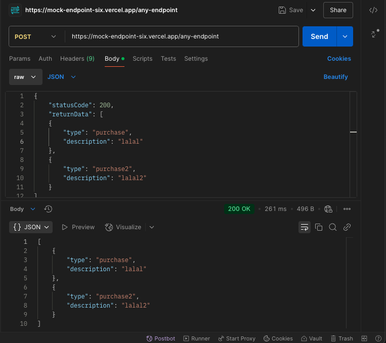

# Mock Endpoint

Express JS App to mock any endpoint with:

- any HTTP method
- any status code
- any return data

## Example Usage



## Installation

Clone this repository, then run this commands:

```bash
npm install
npm run dev
```
